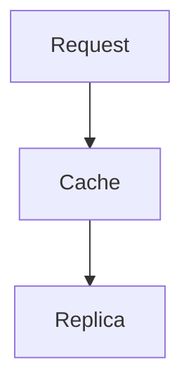

## What we saw

Order counts on the ops dashboard were stale, but [only for some tenants](./tenancy.md).



## The measurement bug

The TTL started at cache write. See [the ADR](../decisions/0007-cache-keys.md) for
the original design, and .

```python
entry.expires_at = now() + timedelta(seconds=60)  # wrong clock
```

## The trade-off

Stamping the replica LSN costs a round trip per miss.
